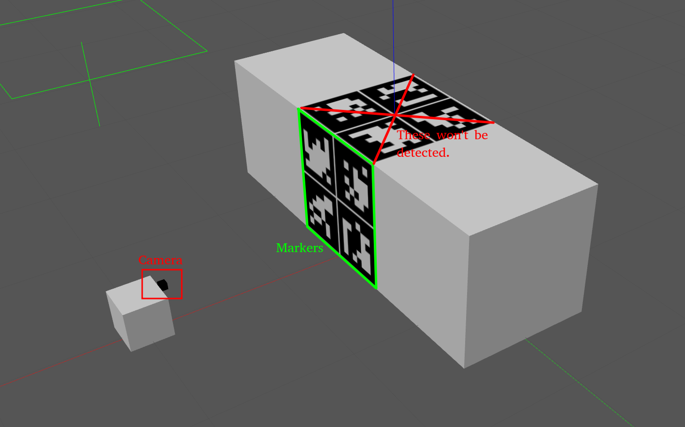

# Pose Estimation With ArUco Marker Detection

## Overview

This project implements pose estimation using ArUco marker detection with weighted fusion algorithms. The system can detect multiple ArUco markers on a box and fuse their pose estimates to improve accuracy and robustness.

## System Architecture

The pose estimation system consists of:
- Camera-based ArUco marker detection
- Individual marker pose estimation
- Weighted pose fusion algorithm
- Real-time pose output in camera optical frame and base link frame

## Fusion Algorithm

### Weight Calculation

The system uses a dual-weight approach combining distance and angle factors:

```
W_i^{dist} = 1 / (1 + α · d_i²)
W_i^{angle} = cos²(θ_i)
W_i = W_i^{dist} · W_i^{angle}
```

Where:
- `α` is an adjustable parameter
- `d_i` is the distance to marker i
- `θ_i` is the angle of marker i

### Pose Fusion

The final pose estimate is calculated as a weighted average:

```
P = (Σ W_i · P_i) / (Σ W_i)
```

## Test Cases

The system was evaluated with different marker configurations on the same box:

1. **Case 1**: Single marker
2. **Case 2A**: Two markers - horizontal placement
3. **Case 2B**: Two markers - diagonal placement  
4. **Case 3**: Four markers
5. **Case 4**: Six markers
6. **Case 5**: Nine markers

*Note: As more markers are placed on the same box, individual marker size decreases*


## How to run the program?

1. Modify `run_sim.sh` first, you have to change the path below to your local directory.
```
export GAZEBO_RESOURCE_PATH="/home/ryanchen/aruco_ws/src/aruco_pose_detection"  
```
2. Copmile the package and source the workspace.
3. Run the `run_sim.sh`.
4. Run the `rosrun aruco_pose_detection aruco_detection_node.


## Experimental Results




### Distance: 2 meters

#### Angle: 0°

| Case | Merged Result (x, y, z) |
|------|------------------------|
| 1 | (-0.0028, -0.2033, 1.8278) |
| 2A | (-0.0028, -0.2031, 1.8304) |
| 2B | (-0.0029, -0.2059, 1.8311) |
| 3 | (-0.0029, -0.2050, 1.8317) |
| 4 | (-0.0052, -0.2099, 1.8310) |
| 5 | (0.0007, -0.2031, 1.8257) |

#### Angle: 15°

| Case | Merged Result (x, y, z) |
|------|------------------------|
| 1 | (-0.0043, -0.2024, 1.8276) |
| 2A | (-0.0019, -0.2015, 1.8283) |
| 2B | (-0.0017, -0.2088, 1.8288) |
| 3 | (-0.0018, -0.2061, 1.8270) |
| 4 | (-0.0056, -0.2025, 1.8319) |
| 5 | (-0.0008, -0.2034, 1.8336) |

#### Angle: 30°

| Case | Merged Result (x, y, z) |
|------|------------------------|
| 1 | (-0.0019, -0.2032, 1.8280) |
| 2A | (-0.0015, -0.2061, 1.8321) |
| 2B | (-0.0043, -0.2044, 1.8310) |
| 3 | (-0.0039, -0.2041, 1.8306) |
| 4 | (-0.0032, -0.2041, 1.8335) |
| 5 | (-0.0022, -0.2054, 1.8323) |

#### Angle: 45°

| Case | Merged Result (x, y, z) |
|------|------------------------|
| 1 | (-0.0009, -0.2032, 1.8231) |
| 2A | (-0.0038, -0.2047, 1.8331) |
| 2B | (0.0002, -0.2018, 1.8202) |
| 3 | (-0.0036, -0.2040, 1.8328) |
| 4 | (0.0015, -0.2029, 1.8228) |
| 5 | (-0.0002, -0.2035, 1.8242) |

### Distance: 5 meters

Results show similar patterns with increased distance affecting accuracy. At 5 meters, the system maintains reasonable pose estimation across all test cases.

### Distance: 10 meters

At longer distances, some configurations failed to provide reliable detections, particularly:
- Case 2A at certain angles
- Cases 3-5 at higher angles (30°-45°)

## Key Findings

1. **Single Marker Performance**: Provides baseline accuracy but lacks redundancy
2. **Multi-Marker Fusion**: Generally improves pose stability and accuracy
3. **Distance Impact**: Accuracy degrades with distance, with complete failures at 10m for complex configurations
4. **Angle Sensitivity**: System performance varies with viewing angle, with some angles providing better detection rates
5. **Marker Density Trade-off**: More markers can improve accuracy but smaller individual marker size may reduce detection reliability

## System Output

The system provides real-time logging including:
- Camera image capture confirmation
- ArUco detection results with marker counts
- Individual marker poses in camera optical frame
- Transformed poses in camera base link frame
- Distance calculations and weight assignments
- Final fused pose estimation
